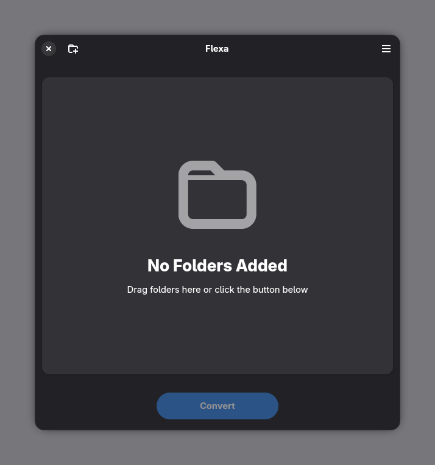

<div align="center">
<h1>Flexa</h1>
<a href="https://github.com/eucaue/flexa">
   
</a>
<a href="#">
   
</a>
<a href="#">
  
</a>
<a href="#">
  
</a>
<a href="#">
  
</a>
<a href="#">
  
</a>
<br><br>
<p>A simple GNOME app to convert Windows cursor themes to Linux format.</p>

</div>

<div align="center">

</div>

## Features

- Add cursor folders manually or just drag them in
- Convert `.cur` and `.ani` cursors with ease
- Auto-save to your local icons directory

## Installation

### Installing win2xcur

Flexa requires the `win2xcur` command-line tool to convert cursor files.

**Using pipx (Recommended):**

```sh
pipx install win2xcur
```

**Using pip:**

```sh
pip install --user win2xcur
```

**Using RPM (Fedora):**
If you download the RPM package from the [releases page](https://github.com/eucaue/flexa/releases/latest), you can install it using:

```sh
sudo dnf install ./python3-win2xcur-*.rpm
```

---

### From Flathub (coming soon)

```sh
flatpak install flathub io.github.eucaue.flexa
```

### From Release Page

Download the assets from the [latest release](https://github.com/eucaue/flexa/releases/latest).

**Flatpak:**

```sh
flatpak install flexa.flatpak
```

**RPM (Fedora):**

```sh
sudo dnf install ./python3-win2xcur-*.rpm ./flexa-*.rpm
```

### Building with Flatpak

If you have `flatpak-builder` installed, this is the recommended way to build.

1. Install the GNOME SDK and Platform:

```sh
flatpak install flathub org.gnome.Sdk//50 org.gnome.Platform//50
```

2. Build and run:

<details>
<summary>Using <a href="https://just.systems"><code>just</code></a> (Recommended)</summary>

```sh
just build-run
```
</details>

<details>
<summary>Manual Build</summary>

```sh
flatpak-builder --install --force-clean _build io.github.eucaue.flexa.json
flatpak run io.github.eucaue.flexa
```
</details>

> **Note:** The Flatpak calls `win2xcur` on the host via `flatpak-spawn`, so `win2xcur` must still be installed on the host system (see [Installing win2xcur](#installing-win2xcur)).

### Building from source

## Requirements

- GTK 4.10+
- LibAdwaita 1.5+
- PyGObject
- Python 3.11+
- [win2xcur](https://github.com/quantum5/win2xcur) (see [Installing win2xcur](#installing-win2xcur))

```sh
# Fedora
sudo dnf install gtk4-devel libadwaita-devel gobject-introspection-devel meson ninja-build gettext python3-gobject
```

```sh
# Ubuntu / Debian
sudo apt install libgtk-4-dev libadwaita-1-dev libgirepository1.0-dev meson ninja-build gettext python3-gi libglib2.0-bin
```

Then build:

<details>
<summary>Using <a href="https://just.systems"><code>just</code></a> (Recommended)</summary>

```sh
just build-run-native
```
</details>

<details>
<summary>Manual Build</summary>

```sh
meson setup build
meson compile -C build
sudo meson install -C build
flexa
```
</details>

## Usage

1. Hit **+** or drag a cursor folder into the window
2. Repeat for as many themes as you want
3. Hit **Convert**, you'll get a toast when it's done with an **Open** shortcut to the output folder

You can change the output directory in **Preferences**.

### Output

Each theme is saved as its own subfolder (named after the source folder) inside your configured output directory (`~/.local/share/icons` by default).

## Contributing

Found a bug or want a feature? Open an issue or PR at [github.com/eucaue/flexa](https://github.com/eucaue/flexa/issues), contributions are welcome.

## Acknowledgements

Flexa is built on top of and inspired by these projects:

- **[win2xcur](https://github.com/quantum5/win2xcur)**: does the actual conversion heavy lifting
- **[win-cursor-2-linux](https://github.com/lmezar/win-cursor-2-linux)**: the script that sparked the idea

## License

GPL-3.0-or-later
